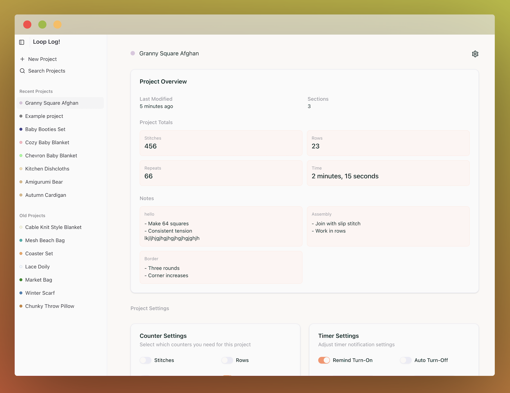

# Stitch Counter 2

A tracking and management tool for knitting and crocheting projects. Stitch Counter helps crafters track stitches, rows, repeats, and time spent on different sections of their projects.

## Features

- **Project Management**
  - Create and manage multiple projects
  - Customize each project with a color identifier
  - Organize projects into multiple sections
  - Track progress across all sections

- **Counters**
  - Track stitches, rows, repeats, and time per section
  - Enable/disable specific counters based on project needs
  - Automatic totals calculation across all sections

- **Timer Functionality**
  - Track time spent on each section
  - Auto-pause timer after period of inactivity
  - Reminder notifications to resume timing
  - Time tracking persists between sessions

- **Notes & Documentation**
  - Add section-specific notes
  - View all project notes in a central location

- **Pop-out Counter Mode**
  - Launch a compact pop-up window so other applications can be used while counting
  - Perfect for using alongside pattern PDFs or watching videos
  - Automatically syncs with the main application

## Usage Guide

### Creating a Project

1. Click the "+" button in the sidebar to create a new project
2. Rename the project accordingly
3. Customize the project color (optional)
4. Configure which counters you need in "Counter Settings"
5. Optionally configure timer settings

### Managing Sections

1. Click "Add Section" in the sidebar to create new project sections
2. Use the dropdown menu in each section to:
   - Rename sections
   - Delete sections
3. Select a section to view and edit its counters and notes

### Using Counters

- Click the increment/decrement buttons to adjust values
- Click the reset button to set a counter back to zero
- When all three counters are active, they display in compact mode

### Using the Timer

1. Click the play/pause button to start or stop the timer
2. Configure timer settings in the main project view:
   - Auto Turn-Off: Pauses the timer after inactivity
   - Remind Turn-On: Sends notifications to resume timing

### Working with Notes

1. Click "Edit Notes" to add notes to the current section
2. Notes can be viewed in the main Project Overview

### Using Pop-up Mode

1. Click "Open Counter!" to open a compact counter window
2. Changes in either window will sync automatically

## Technology Stack

- React 19 with TypeScript
- Vite
- Zustand for state management
- Tailwind CSS & shadcn/ui for styling
- Local storage persistence with cross-window syncing

## License

[GPL-3.0](LICENSE)

## Acknowledgments

- Built with [React](https://react.dev/)
- UI components from [shadcn/ui](https://ui.shadcn.com/)
- State management with [Zustand](https://zustand-demo.pmnd.rs/)
